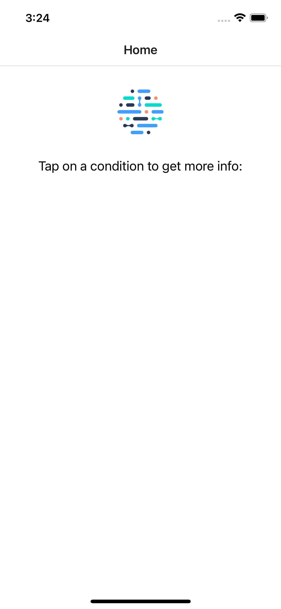

Frontend Coding Exercise
========================

This repository contains a minimal example of a React Native application created using Expo. The application is designed
to display a list of health conditions and their details. It serves as a starting point for you to extend during a live 
coding exercise. It is important to note that this project does not adhere to established industry best practices and 
should not be considered representative of production-ready code.

During your interview, we will provide you with a list of requirements that you will be asked to implement. While you 
have the freedom to choose how to implement these requirements, be prepared to provide a brief explanation of your 
choices. In our codebase, we utilize [React Redux](https://react-redux.js.org/) and [Redux Saga](https://redux-saga.js.org/).
Consequently, these dependencies have been included in the project; you are free to use them or not, as you see fit.

## Getting Started

Instructions for setting up the local development environment have intentionally been left vague. You are free to use 
any operating system and development environment that you have access to and feel comfortable with. If you encounter any
questions or issues while setting up your environment, please reach out to your interviewer.

Before your scheduled interview, ensure that you can run the project locally and that you can view the provided screen 
in a web browser or on an iOS or Android simulator:

## Pre-requisites

The project was created using Node v18.16.1 and npm v9.5.1.